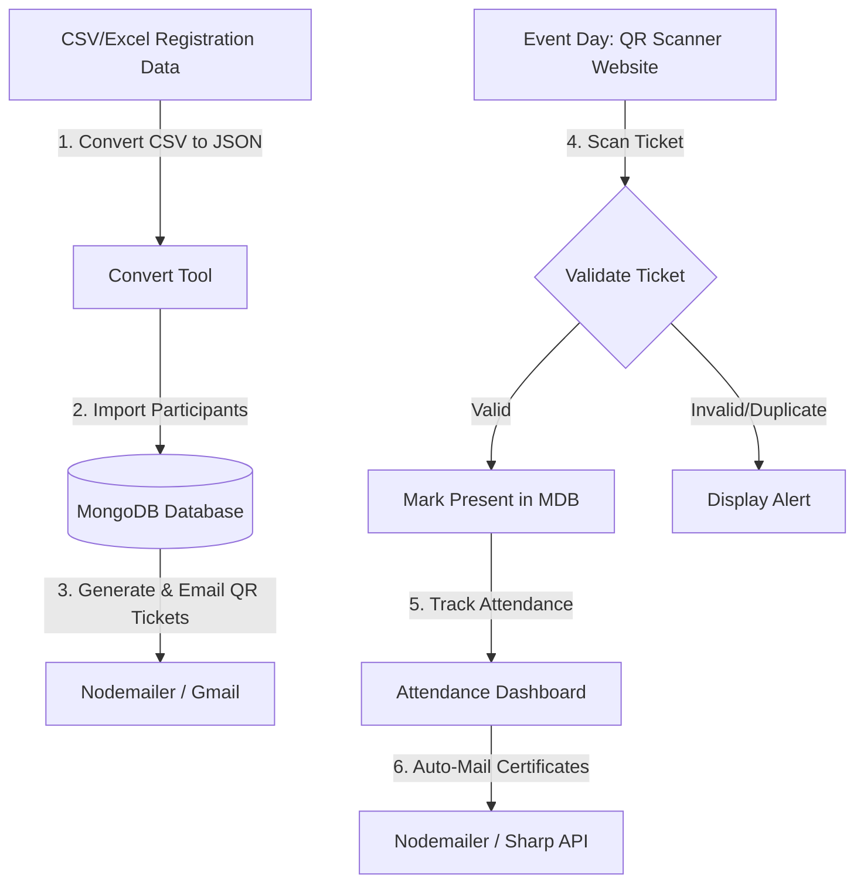

# Abhivriddhi — Admin Panel & Deployment Guide

This guide provides a comprehensive operational overview of the **Abhivriddhi Admin Panel**, a step-by-step workflow for event managers, and detailed deployment blueprints for both the **Main Website** and the **Admin Panel**.

---

## Part 1: What the Admin Panel Does & How it Works

The Abhivriddhi Admin Panel is a high-performance event-management ecosystem built with **Next.js 15**, **MongoDB**, and **Tailwind CSS**. It is designed to digitize and automate the lifecycle of student events—from bulk participant registration and electronic ticket delivery to real-time QR-based attendance tracking and automated post-event certificate generation.

### Core Features



1. **JWT-Secured Admin Control Panel**: Provides role-based access control. Critical features like imports, email sending, and exports are restricted behind secure HTTP-only cookies storing JSON Web Tokens.
2. **Data Pipeline (CSV/Excel ➔ JSON Converter)**: Event coordinators can import registration data from Google Forms or Excel. The admin panel includes a built-in converter that normalizes names, validates emails, parses ticket types, and compiles them into a structured database-ready format.
3. **Automated Ticket Engine with Dynamic QR Codes**: Reads imported participant data and mails tickets with custom-generated, high-contrast QR codes directly to the students' registered emails using **Nodemailer**.
4. **Offline-capable, Zero-Config QR Scanner**: Built on top of the `html5-qrcode` library, the main landing page uses any device's built-in camera (mobile phone, laptop, web-cam) to read ticket QR codes, fetch the corresponding participant profile, and instantly record entry times.
5. **Real-time Attendance Visualizer**: Displays a dynamic view of attendees divided by ticket categories (`DAY1`, `DAY2`, `COMBO`). Includes searching, real-time filters, and a **one-click Excel/CSV export** feature for report generation.
6. **Automated Certificate Delivery Engine**: Synthesizes custom-styled participant certificates dynamically (using background image merging or PDF rendering via **Sharp**) and mails them individually to attendees, keeping an audit trail of sent certificates to avoid duplicates.

---

## Part 2: Step-by-Step Operator Guide (How to Use It)

Follow this chronological checklist to orchestrate an event seamlessly:

### Step 1: Initialize Database & Root Admin Account
When deploying for the first time, you must seed the initial administrator credentials.
1. Ensure your server environment variables are configured (see **Part 3: Configuration**).
2. Start the admin server (local or deployed).
3. Send a **POST** request to `/api/auth/seed` using a tool like Postman, curl, or standard API clients:
   ```json
   {
     "name": "Super Admin",
     "email": "your_email@gmail.com",
     "password": "yourpassword",
     "seedKey": "your_configured_seed_key"
   }
   ```
4. Once seeded successfully, navigate to `/login` to authenticate.

### Step 2: Format & Convert Registration Data
1. Export your registration data (from Google Forms, Townscript, or other ticketing portals) as a `.csv` file.
2. Format your CSV structure so that it contains the following headers:
   ```csv
   Name,PRN,Email,TicketType,RegisteredEvent
   ```
   * **Name**: Student's full name (best in uppercase, e.g. `VIKRANT THAKUR`).
   * **PRN**: Student's unique university registration number (leave empty for non-VIT students).
   * **Email**: Registered email address (serves as the primary key/ID).
   * **TicketType**: Must be exactly `DAY1`, `DAY2`, or `COMBO`.
   * **RegisteredEvent**: The primary sub-event name (e.g. `Hackathon`, `Seminar`).
3. Log in to the Admin Dashboard and navigate to the **Convert Data** page (`/convert-data`).
4. Upload your CSV file, click **Convert**, and download the resulting `.json` configuration file.

### Step 3: Insert Participants into Database
1. Go to the **Add Participant** page (`/add-participant`).
2. Paste or upload the JSON content generated in **Step 2**.
3. Select **Add Participants**. This populates the `users` collection.
   > [!WARNING]
   > Ensure you have backed up any previous event tables. The dashboard includes utility buttons to clear existing day-wise and master collections to reset for a new event.

### Step 4: Dispatch Event Tickets via Mail
1. Navigate to the **Send Tickets** page (`/send-tickets`).
2. This page lists all registered users who have not yet received their tickets.
3. Review the template, then trigger the queue. The backend will sequentially:
   * Build a unique QR code payload using the participant's key fields (`Name`, `Email`, `TicketType`).
   * Assemble a premium HTML email template with embedded ticket designs.
   * Dispatch the emails using the SMTP mail server.

### Step 5: Mark Live Attendance on Event Day
On the day of the event, position scanners at your entry points.
1. Open the main portal landing page (`/`) on any smartphone, tablet, or laptop.
2. Grant camera permissions when prompted.
3. Point the camera at a participant's printed or digital QR code.
4. The system will read the QR, request validation from the server, and instantly display one of three visual/audio indicators:
   * **Green (Valid Ticket)**: Marks attendance under the corresponding category (`DAY1`, `DAY2`, or `COMBO`) in the database.
   * **Yellow (Already Scanned)**: Alerts the operator that this ticket was scanned earlier (shows timestamp of first entry to prevent duplicate entries).
   * **Red (Invalid)**: Warns the operator of spoofed or unrecognized tickets.

### Step 6: View Reports & Distribute Certificates
1. Access the **Attendance** page (`/attendance`) to view live tallies of attendees in real-time. Use the search bar to locate specific students or filter by ticket type. Click **Export to CSV** for registration records.
2. Once the event finishes, go to the **Certificates** page (`/certificates`).
3. The system compares the attendance logs against the main registry and queues up participants who successfully attended.
4. Click **Send Certificates** to auto-generate personalized certificates and email them to the attendees.

---

## Part 3: Environment Variables & Database Configuration

To run the application, create a `.env` file inside the `admin/` directory (referencing `.env.example`).

```env
# Database Credentials
MONGODB_URI=mongodb+srv://<username>:<password>@cluster0.abcde.mongodb.net/abhivriddhi?retryWrites=true&w=majority

# SMTP Mail Settings (Gmail App Passwords)
EMAIL=abhivriddhi.vit@gmail.com
EMAIL_PASSWORD=xxxx xxxx xxxx xxxx

# Security Tokens
JWT_SECRET=use_a_long_random_cryptographic_string_here
SEED_KEY=your_temporary_admin_creation_password_key
```

### Setting up Gmail SMTP Authentication
For Nodemailer to send emails, you must configure a Google App Password rather than your standard account password:
1. Go to your **Google Account settings**.
2. Enable **2-Step Verification** (Mandatory).
3. Search for or navigate to **App Passwords** (`https://myaccount.google.com/apppasswords`).
4. Enter an app name (e.g. `Abhivriddhi Admin Panel`) and generate the code.
5. Copy the generated 16-character code (ignoring spaces) and paste it into the `EMAIL_PASSWORD` variable.

---

## Part 4: Deployment Guide

### A. Deploying the Main Website (React + Vite)
The main website (`main-website/`) is a fast, static single-page application. It has no backend routes and can be hosted completely for free.

#### Method 1: Vercel (Recommended)
1. Push your repository to GitHub.
2. Sign in to [Vercel](https://vercel.com).
3. Click **Add New** ➔ **Project** and import your repository.
4. In the settings, set:
   * **Framework Preset**: `Vite`
   * **Root Directory**: `main-website`
   * **Build Command**: `npm run build`
   * **Output Directory**: `dist`
5. Click **Deploy**. Vercel will provide an SSL-secured custom URL automatically.

#### Method 2: Netlify
1. Go to [Netlify](https://netlify.com) and click **Add new site** ➔ **Import an existing project**.
2. Select your repository.
3. Configure the build settings:
   * **Base directory**: `main-website`
   * **Build command**: `npm run build`
   * **Publish directory**: `main-website/dist`
4. Click **Deploy**.

---

### B. Deploying the Admin Panel (Next.js 15)
The admin panel is dynamic and contains serverless API routes that connect to MongoDB and handle SMTP operations. It must be hosted on a platform supporting Server-Side Rendering (SSR).

#### Method 1: Vercel (Fastest & Easiest)
1. Go to the [Vercel Dashboard](https://vercel.com).
2. Import your repository.
3. In the settings:
   * **Root Directory**: `admin`
   * **Framework Preset**: `Next.js`
4. Expand the **Environment Variables** section and insert the keys from your `.env` file:
   * `MONGODB_URI`
   * `EMAIL`
   * `EMAIL_PASSWORD`
   * `JWT_SECRET`
   * `SEED_KEY`
5. Click **Deploy**.
   > [!NOTE]
   > Ensure your MongoDB Atlas cluster whitelists access from **0.0.0.0/0** (all IP addresses) since Vercel utilizes dynamic serverless IPs, or configure a secure database proxy.

---

#### Method 2: Self-Hosting on a VPS (Ubuntu Server)
For production environments requiring custom domains, maximum control, or large-volume email tasks, self-hosting is highly reliable.

##### Prerequisites
* An Ubuntu 22.04 / 24.04 VPS (DigitalOcean, AWS EC2, Linode, etc.)
* Node.js v18 or v20 installed
* A domain name pointing to your VPS IP address

##### Step 1: Install Node.js, PM2, and Nginx
Connect to your VPS via SSH and execute:
```bash
# Update package registries
sudo apt update && sudo apt upgrade -y

# Install Node.js (via NodeSource)
curl -fsSL https://deb.nodesource.com/setup_20.x | sudo -E bash -
sudo apt-get install -y nodejs

# Install PM2 (Process Manager) globally
sudo npm install pm2 -g

# Install Nginx
sudo apt install nginx -y
```

##### Step 2: Clone & Build the Application
```bash
# Clone the repository (if not already done)
git clone https://github.com/Vikrant-K-Thakur/Abhivriddhi-Main-Website.git /var/www/abhivriddhi

# Navigate to the admin folder
cd /var/www/abhivriddhi/admin

# Install dependencies
npm install

# Create production environment variables
nano .env
# (Paste your config variables here, save and exit)

# Build the Next.js production build
npm run build
```

##### Step 3: Run with PM2
To keep the application running persistently in the background:
```bash
# Start Next.js server with PM2
pm2 start npm --name "abhivriddhi-admin" -- start

# Configure PM2 to start on boot
pm2 startup
pm2 save
```

##### Step 4: Configure Reverse Proxy (Nginx)
Configure Nginx to route external requests on port 80/443 to Next.js running locally on port 3000.
```bash
# Create Nginx configuration
sudo nano /etc/nginx/sites-available/admin.yourdomain.com
```

Paste the configuration:
```nginx
server {
    listen 80;
    server_name admin.yourdomain.com; # Replace with your sub-domain or domain

    location / {
        proxy_pass http://localhost:3000;
        proxy_http_version 1.1;
        proxy_set_header Upgrade $http_upgrade;
        proxy_set_header Connection 'upgrade';
        proxy_set_header Host $host;
        proxy_cache_bypass $http_upgrade;
    }
}
```

Enable the site configuration and restart Nginx:
```bash
sudo ln -s /etc/nginx/sites-available/admin.yourdomain.com /etc/nginx/sites-enabled/
sudo nginx -t
sudo systemctl restart nginx
```

##### Step 5: Secure with SSL (Let's Encrypt Certbot)
```bash
sudo apt install certbot python3-certbot-nginx -y
sudo certbot --nginx -d admin.yourdomain.com
```
Follow the interactive prompts to enable automatic SSL redirection. Your Admin Panel is now completely deployed, secure, and ready for operations!
